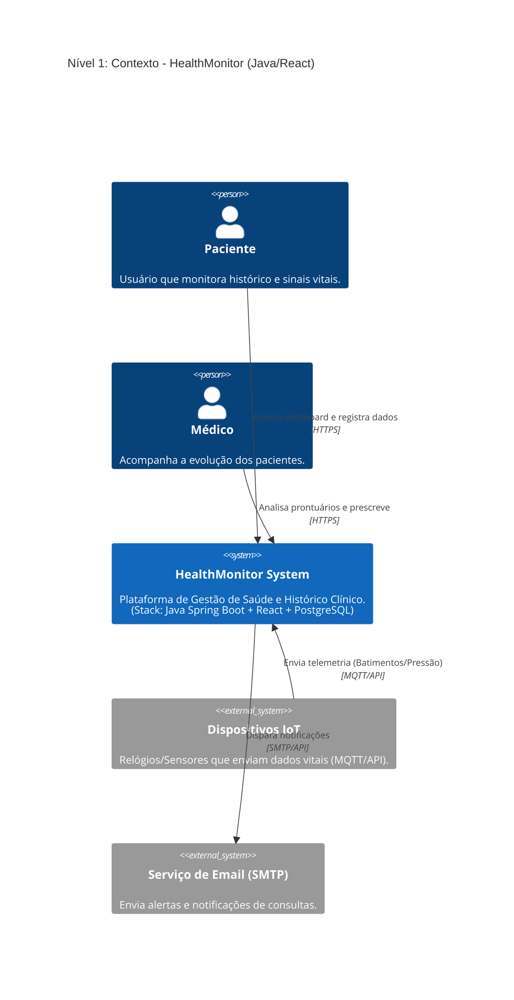

# C4 - Nível 1: Diagrama de Contexto

## HealthMonitor System

## Descrição dos Elementos

| Elemento                 | Tipo            | Descrição                                                                             |
| ------------------------ | --------------- | ------------------------------------------------------------------------------------- |
| **Paciente**             | Pessoa          | Usuário final que monitora seu histórico médico e sinais vitais através da plataforma |
| **Médico**               | Pessoa          | Profissional de saúde que acompanha a evolução dos pacientes e realiza prescrições    |
| **HealthMonitor System** | Sistema         | Plataforma central de gestão de saúde construída com Clean Architecture               |
| **Dispositivos IoT**     | Sistema Externo | Wearables e sensores que coletam dados vitais em tempo real                           |
| **Serviço de Email**     | Sistema Externo | Sistema responsável pelo envio de alertas e notificações                              |

## Decisões Arquiteturais

1. **Comunicação HTTPS**: Toda comunicação entre usuários e sistema é criptografada
2. **Integração IoT via MQTT**: Protocolo leve e eficiente para dispositivos com recursos limitados
3. **Desacoplamento de Email**: Serviço externo para garantir entregabilidade e não sobrecarregar o sistema principal
