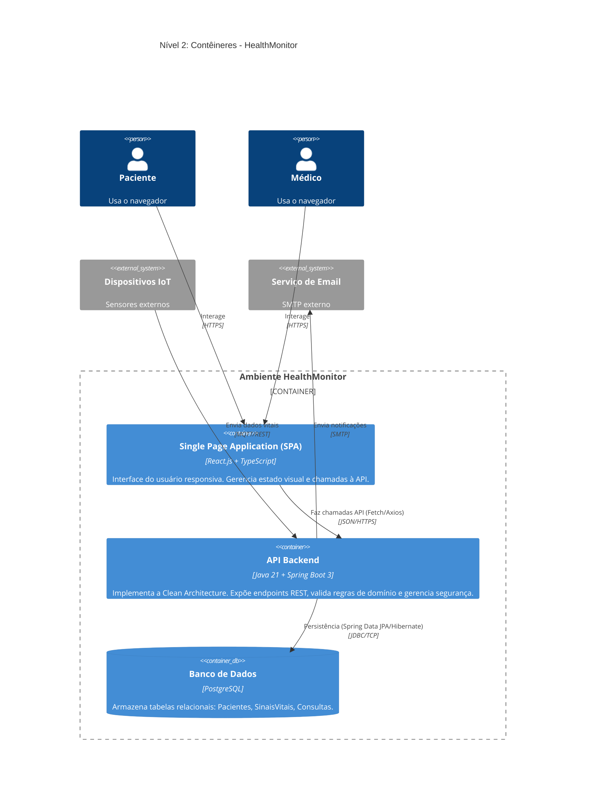

# C4 - Nível 2: Diagrama de Contêineres

## HealthMonitor Containers

## Descrição dos Contêineres

| Contêiner          | Tecnologia              | Responsabilidade                                                       |
| ------------------ | ----------------------- | ---------------------------------------------------------------------- |
| **SPA (Frontend)** | React.js + TypeScript   | Interface responsiva, gerenciamento de estado, chamadas à API REST     |
| **API Backend**    | Java 21 + Spring Boot 3 | Clean Architecture, endpoints REST, regras de domínio, segurança (JWT) |
| **Banco de Dados** | PostgreSQL              | Persistência de dados relacionais com integridade referencial          |

## Fluxos de Dados

1. **Usuário → SPA**: Interação via navegador (HTTPS)
2. **SPA → API**: Chamadas REST com JSON (Axios/Fetch)
3. **API → BD**: Persistência via Spring Data JPA (JDBC)
4. **IoT → API**: Telemetria via MQTT ou REST endpoints
5. **API → Email**: Disparo de notificações via SMTP

## Tecnologias e Justificativas

| Escolha                | Justificativa                                                             |
| ---------------------- | ------------------------------------------------------------------------- |
| **React + TypeScript** | SPA moderna com tipagem estática para maior confiabilidade                |
| **Spring Boot 3**      | Framework robusto com suporte nativo a Clean Architecture                 |
| **PostgreSQL**         | SGBD relacional open-source com excelente performance e conformidade ACID |
