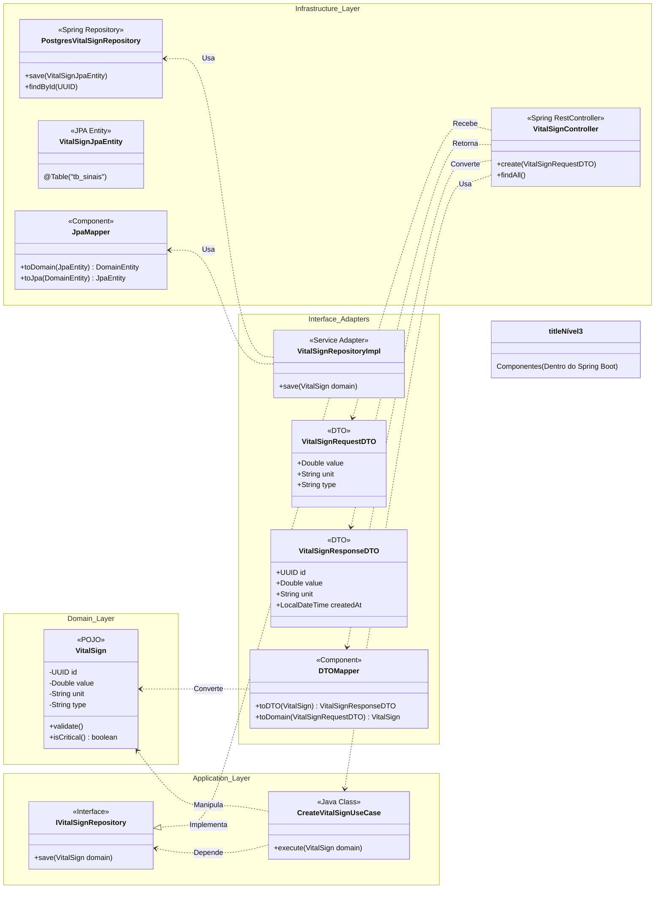
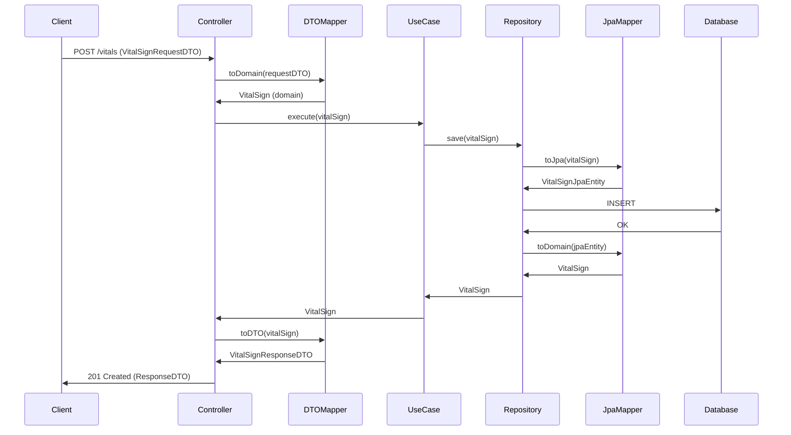

# C4 - Nível 3: Diagrama de Componentes

## Componentes do Spring Boot (Clean Architecture)

## Camadas da Clean Architecture

| Camada                   | Componentes                                      | Responsabilidade                                                         |
| ------------------------ | ------------------------------------------------ | ------------------------------------------------------------------------ |
| **Domain Layer**         | `VitalSign`                                      | Entidades de domínio, regras de negócio puras, sem dependências externas |
| **Application Layer**    | `CreateVitalSignUseCase`, `IVitalSignRepository` | Casos de uso, orquestração de fluxos, interfaces de abstração            |
| **Interface Adapters**   | `VitalSignRepositoryImpl`, DTOs, `DTOMapper`     | Adaptadores, conversão entre domínio e infraestrutura                    |
| **Infrastructure Layer** | Controllers, JPA Repositories, Entities, Mappers | Frameworks, drivers, detalhes de implementação                           |

## Fluxo de Dados (Request → Response)

## Decisões Arquiteturais

1. **DTOs na Interface Adapters**: Separação clara entre representação externa (API) e domínio interno
2. **Dois tipos de Mapper**:
   - `DTOMapper`: Converte entre API ↔ Domain
   - `JpaMapper`: Converte entre Domain ↔ Persistência
3. **Interfaces no Application Layer**: Inversão de dependência para desacoplar implementações
