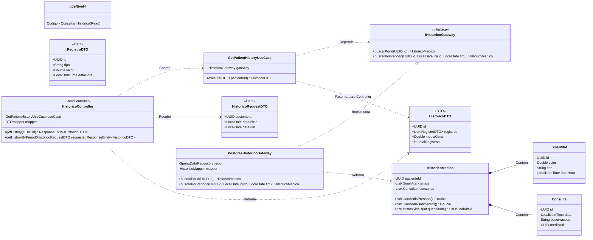
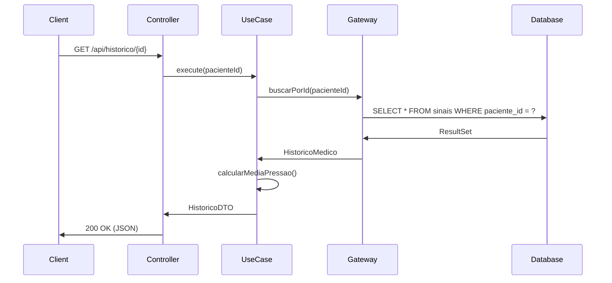

# C4 - Nível 4: Código - Consultar Histórico

## Diagrama de Classes



## Código Java

### Domain Layer - HistoricoMedico.java

```java
package com.healthmonitor.domain.entities;

import java.util.List;
import java.util.UUID;
import java.util.Comparator;

public class HistoricoMedico {
    private UUID pacienteId;
    private List<SinalVital> sinais;
    private List<Consulta> consultas;

    public HistoricoMedico(UUID pacienteId, List<SinalVital> sinais, List<Consulta> consultas) {
        this.pacienteId = pacienteId;
        this.sinais = sinais;
        this.consultas = consultas;
    }

    public Double calcularMediaPressao() {
        return sinais.stream()
                .filter(s -> s.getTipo().contains("BLOOD_PRESSURE"))
                .mapToDouble(SinalVital::getValor)
                .average()
                .orElse(0.0);
    }

    public Double calcularMediaBatimentos() {
        return sinais.stream()
                .filter(s -> "HEART_RATE".equals(s.getTipo()))
                .mapToDouble(SinalVital::getValor)
                .average()
                .orElse(0.0);
    }

    public List<SinalVital> getUltimosSinais(int quantidade) {
        return sinais.stream()
                .sorted(Comparator.comparing(SinalVital::getDataHora).reversed())
                .limit(quantidade)
                .toList();
    }

    // Getters
    public UUID getPacienteId() { return pacienteId; }
    public List<SinalVital> getSinais() { return sinais; }
    public List<Consulta> getConsultas() { return consultas; }
}
```

### Application Layer - GetPatientHistoryUseCase.java

```java
package com.healthmonitor.application.usecases;

import com.healthmonitor.application.gateways.IHistoricoGateway;
import com.healthmonitor.domain.entities.HistoricoMedico;
import com.healthmonitor.infrastructure.dtos.HistoricoDTO;
import com.healthmonitor.infrastructure.dtos.RegistroDTO;

import java.util.UUID;

public class GetPatientHistoryUseCase {

    private final IHistoricoGateway gateway;

    public GetPatientHistoryUseCase(IHistoricoGateway gateway) {
        this.gateway = gateway;
    }

    public HistoricoDTO execute(UUID pacienteId) {
        HistoricoMedico historico = gateway.buscarPorId(pacienteId);

        return new HistoricoDTO(
            historico.getPacienteId(),
            historico.getSinais().stream()
                .map(s -> new RegistroDTO(s.getId(), s.getTipo(), s.getValor(), s.getDataHora()))
                .toList(),
            historico.calcularMediaPressao(),
            historico.getSinais().size()
        );
    }
}
```

### Interface Adapters - DTOs

```java
package com.healthmonitor.infrastructure.dtos;

import java.time.LocalDateTime;
import java.util.List;
import java.util.UUID;

public record HistoricoDTO(
    UUID id,
    List<RegistroDTO> registros,
    Double mediaGeral,
    int totalRegistros
) {}

public record RegistroDTO(
    UUID id,
    String tipo,
    Double valor,
    LocalDateTime dataHora
) {}

public record HistoricoRequestDTO(
    UUID pacienteId,
    LocalDate dataInicio,
    LocalDate dataFim
) {}
```

### Infrastructure Layer - HistoricoController.java

```java
package com.healthmonitor.infrastructure.controllers;

import com.healthmonitor.application.usecases.GetPatientHistoryUseCase;
import com.healthmonitor.infrastructure.dtos.HistoricoDTO;
import org.springframework.http.ResponseEntity;
import org.springframework.web.bind.annotation.*;

import java.util.UUID;

@RestController
@RequestMapping("/api/historico")
public class HistoricoController {

    private final GetPatientHistoryUseCase useCase;

    public HistoricoController(GetPatientHistoryUseCase useCase) {
        this.useCase = useCase;
    }

    @GetMapping("/{pacienteId}")
    public ResponseEntity<HistoricoDTO> getHistory(@PathVariable UUID pacienteId) {
        HistoricoDTO historico = useCase.execute(pacienteId);
        return ResponseEntity.ok(historico);
    }
}
```

## Fluxo de Execução


