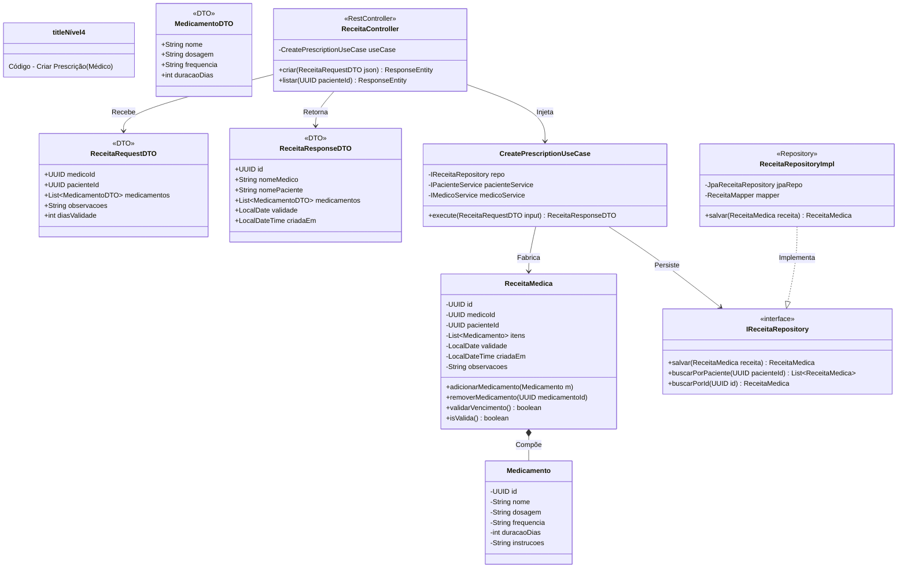
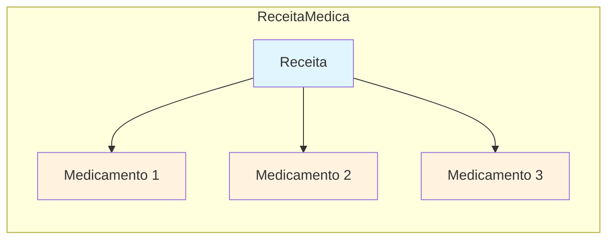

# C4 - Nível 4: Código - Criar Prescrição

## Diagrama de Classes



## Código Java

### Domain Layer - ReceitaMedica.java

```java
package com.healthmonitor.domain.entities;

import java.time.LocalDate;
import java.time.LocalDateTime;
import java.util.ArrayList;
import java.util.List;
import java.util.UUID;

public class ReceitaMedica {
    private UUID id;
    private UUID medicoId;
    private UUID pacienteId;
    private List<Medicamento> itens;
    private LocalDate validade;
    private LocalDateTime criadaEm;
    private String observacoes;

    public ReceitaMedica(UUID medicoId, UUID pacienteId, int diasValidade, String observacoes) {
        this.id = UUID.randomUUID();
        this.medicoId = medicoId;
        this.pacienteId = pacienteId;
        this.itens = new ArrayList<>();
        this.validade = LocalDate.now().plusDays(diasValidade);
        this.criadaEm = LocalDateTime.now();
        this.observacoes = observacoes;
    }

    public void adicionarMedicamento(Medicamento medicamento) {
        if (medicamento == null) {
            throw new IllegalArgumentException("Medicamento não pode ser nulo");
        }
        this.itens.add(medicamento);
    }

    public void removerMedicamento(UUID medicamentoId) {
        this.itens.removeIf(m -> m.getId().equals(medicamentoId));
    }

    public boolean validarVencimento() {
        return LocalDate.now().isBefore(validade) || LocalDate.now().isEqual(validade);
    }

    public boolean isValida() {
        return validarVencimento() && !itens.isEmpty();
    }

    // Getters
    public UUID getId() { return id; }
    public UUID getMedicoId() { return medicoId; }
    public UUID getPacienteId() { return pacienteId; }
    public List<Medicamento> getItens() { return itens; }
    public LocalDate getValidade() { return validade; }
    public LocalDateTime getCriadaEm() { return criadaEm; }
    public String getObservacoes() { return observacoes; }
}
```

### Domain Layer - Medicamento.java

```java
package com.healthmonitor.domain.entities;

import java.util.UUID;

public class Medicamento {
    private UUID id;
    private String nome;
    private String dosagem;
    private String frequencia;
    private int duracaoDias;
    private String instrucoes;

    public Medicamento(String nome, String dosagem, String frequencia, int duracaoDias) {
        this.id = UUID.randomUUID();
        this.nome = nome;
        this.dosagem = dosagem;
        this.frequencia = frequencia;
        this.duracaoDias = duracaoDias;
        validate();
    }

    private void validate() {
        if (nome == null || nome.isBlank()) {
            throw new IllegalArgumentException("Nome do medicamento é obrigatório");
        }
        if (dosagem == null || dosagem.isBlank()) {
            throw new IllegalArgumentException("Dosagem é obrigatória");
        }
        if (duracaoDias <= 0) {
            throw new IllegalArgumentException("Duração deve ser maior que zero");
        }
    }

    // Getters
    public UUID getId() { return id; }
    public String getNome() { return nome; }
    public String getDosagem() { return dosagem; }
    public String getFrequencia() { return frequencia; }
    public int getDuracaoDias() { return duracaoDias; }
    public String getInstrucoes() { return instrucoes; }

    public void setInstrucoes(String instrucoes) { this.instrucoes = instrucoes; }
}
```

### Application Layer - CreatePrescriptionUseCase.java

```java
package com.healthmonitor.application.usecases;

import com.healthmonitor.application.gateways.IReceitaRepository;
import com.healthmonitor.application.gateways.IPacienteService;
import com.healthmonitor.application.gateways.IMedicoService;
import com.healthmonitor.domain.entities.ReceitaMedica;
import com.healthmonitor.domain.entities.Medicamento;
import com.healthmonitor.infrastructure.dtos.*;

public class CreatePrescriptionUseCase {

    private final IReceitaRepository repo;
    private final IPacienteService pacienteService;
    private final IMedicoService medicoService;

    public CreatePrescriptionUseCase(
            IReceitaRepository repo,
            IPacienteService pacienteService,
            IMedicoService medicoService) {
        this.repo = repo;
        this.pacienteService = pacienteService;
        this.medicoService = medicoService;
    }

    public ReceitaResponseDTO execute(ReceitaRequestDTO input) {
        // Validar existência de médico e paciente
        var medico = medicoService.buscarPorId(input.medicoId());
        var paciente = pacienteService.buscarPorId(input.pacienteId());

        // Criar receita
        ReceitaMedica receita = new ReceitaMedica(
            input.medicoId(),
            input.pacienteId(),
            input.diasValidade(),
            input.observacoes()
        );

        // Adicionar medicamentos
        for (MedicamentoDTO medDTO : input.medicamentos()) {
            Medicamento medicamento = new Medicamento(
                medDTO.nome(),
                medDTO.dosagem(),
                medDTO.frequencia(),
                medDTO.duracaoDias()
            );
            receita.adicionarMedicamento(medicamento);
        }

        // Persistir
        ReceitaMedica salva = repo.salvar(receita);

        // Retornar DTO
        return new ReceitaResponseDTO(
            salva.getId(),
            medico.getNome(),
            paciente.getNome(),
            input.medicamentos(),
            salva.getValidade(),
            salva.getCriadaEm()
        );
    }
}
```

### Interface Adapters - DTOs

```java
package com.healthmonitor.infrastructure.dtos;

import java.time.LocalDate;
import java.time.LocalDateTime;
import java.util.List;
import java.util.UUID;

public record ReceitaRequestDTO(
    UUID medicoId,
    UUID pacienteId,
    List<MedicamentoDTO> medicamentos,
    String observacoes,
    int diasValidade
) {}

public record MedicamentoDTO(
    String nome,
    String dosagem,
    String frequencia,
    int duracaoDias
) {}

public record ReceitaResponseDTO(
    UUID id,
    String nomeMedico,
    String nomePaciente,
    List<MedicamentoDTO> medicamentos,
    LocalDate validade,
    LocalDateTime criadaEm
) {}
```

### Infrastructure Layer - ReceitaController.java

```java
package com.healthmonitor.infrastructure.controllers;

import com.healthmonitor.application.usecases.CreatePrescriptionUseCase;
import com.healthmonitor.infrastructure.dtos.ReceitaRequestDTO;
import com.healthmonitor.infrastructure.dtos.ReceitaResponseDTO;
import org.springframework.http.HttpStatus;
import org.springframework.http.ResponseEntity;
import org.springframework.web.bind.annotation.*;

import jakarta.validation.Valid;
import java.util.UUID;

@RestController
@RequestMapping("/api/receitas")
public class ReceitaController {

    private final CreatePrescriptionUseCase useCase;

    public ReceitaController(CreatePrescriptionUseCase useCase) {
        this.useCase = useCase;
    }

    @PostMapping
    public ResponseEntity<ReceitaResponseDTO> criar(@Valid @RequestBody ReceitaRequestDTO request) {
        ReceitaResponseDTO response = useCase.execute(request);
        return ResponseEntity.status(HttpStatus.CREATED).body(response);
    }
}
```

## Padrão Composition



> **Composition Pattern**: `ReceitaMedica` é composta por uma lista de `Medicamento`. Os medicamentos não existem independentemente da receita - quando a receita é deletada, os medicamentos associados também são removidos.
