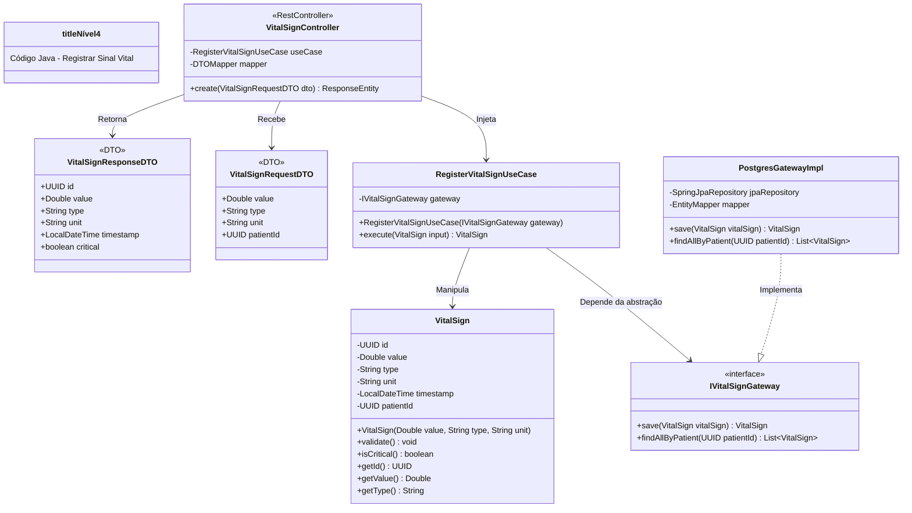

# C4 - Nível 4: Código - Registrar Sinal Vital

## Diagrama de Classes



## Código Java

### Domain Layer - VitalSign.java

```java
package com.healthmonitor.domain.entities;

import java.time.LocalDateTime;
import java.util.UUID;

public class VitalSign {
    private UUID id;
    private Double value;
    private String type;
    private String unit;
    private LocalDateTime timestamp;
    private UUID patientId;

    public VitalSign(Double value, String type, String unit, UUID patientId) {
        this.id = UUID.randomUUID();
        this.value = value;
        this.type = type;
        this.unit = unit;
        this.patientId = patientId;
        this.timestamp = LocalDateTime.now();
        validate();
    }

    public void validate() {
        if (value == null || value < 0) {
            throw new IllegalArgumentException("Valor inválido para sinal vital");
        }
        if (type == null || type.isBlank()) {
            throw new IllegalArgumentException("Tipo de sinal vital é obrigatório");
        }
    }

    public boolean isCritical() {
        return switch (type.toUpperCase()) {
            case "HEART_RATE" -> value < 60 || value > 100;
            case "BLOOD_PRESSURE_SYSTOLIC" -> value < 90 || value > 140;
            case "BLOOD_PRESSURE_DIASTOLIC" -> value < 60 || value > 90;
            case "TEMPERATURE" -> value < 35.5 || value > 37.5;
            default -> false;
        };
    }

    // Getters
    public UUID getId() { return id; }
    public Double getValue() { return value; }
    public String getType() { return type; }
    public String getUnit() { return unit; }
    public LocalDateTime getTimestamp() { return timestamp; }
    public UUID getPatientId() { return patientId; }
}
```

### Application Layer - RegisterVitalSignUseCase.java

```java
package com.healthmonitor.application.usecases;

import com.healthmonitor.application.gateways.IVitalSignGateway;
import com.healthmonitor.domain.entities.VitalSign;

public class RegisterVitalSignUseCase {

    private final IVitalSignGateway gateway;

    public RegisterVitalSignUseCase(IVitalSignGateway gateway) {
        this.gateway = gateway;
    }

    public VitalSign execute(VitalSign vitalSign) {
        vitalSign.validate();
        return gateway.save(vitalSign);
    }
}
```

### Application Layer - IVitalSignGateway.java

```java
package com.healthmonitor.application.gateways;

import com.healthmonitor.domain.entities.VitalSign;
import java.util.List;
import java.util.UUID;

public interface IVitalSignGateway {
    VitalSign save(VitalSign vitalSign);
    List<VitalSign> findAllByPatient(UUID patientId);
}
```

### Infrastructure Layer - PostgresGatewayImpl.java

```java
package com.healthmonitor.infrastructure.gateways;

import com.healthmonitor.application.gateways.IVitalSignGateway;
import com.healthmonitor.domain.entities.VitalSign;
import com.healthmonitor.infrastructure.persistence.VitalSignJpaRepository;
import com.healthmonitor.infrastructure.persistence.VitalSignJpaEntity;
import com.healthmonitor.infrastructure.mappers.EntityMapper;
import org.springframework.stereotype.Service;

import java.util.List;
import java.util.UUID;

@Service
public class PostgresGatewayImpl implements IVitalSignGateway {

    private final VitalSignJpaRepository jpaRepository;
    private final EntityMapper mapper;

    public PostgresGatewayImpl(VitalSignJpaRepository jpaRepository, EntityMapper mapper) {
        this.jpaRepository = jpaRepository;
        this.mapper = mapper;
    }

    @Override
    public VitalSign save(VitalSign vitalSign) {
        VitalSignJpaEntity entity = mapper.toJpa(vitalSign);
        VitalSignJpaEntity saved = jpaRepository.save(entity);
        return mapper.toDomain(saved);
    }

    @Override
    public List<VitalSign> findAllByPatient(UUID patientId) {
        return jpaRepository.findByPatientId(patientId)
                .stream()
                .map(mapper::toDomain)
                .toList();
    }
}
```

## Princípios Clean Architecture Aplicados

| Princípio                 | Aplicação                                                                     |
| ------------------------- | ----------------------------------------------------------------------------- |
| **Dependency Inversion**  | UseCase depende de `IVitalSignGateway` (interface), não da implementação      |
| **Single Responsibility** | Cada classe tem uma única responsabilidade bem definida                       |
| **Open/Closed**           | Novas implementações de gateway podem ser adicionadas sem modificar o UseCase |
| **Domain Isolation**      | `VitalSign` não tem dependências de frameworks externos                       |
