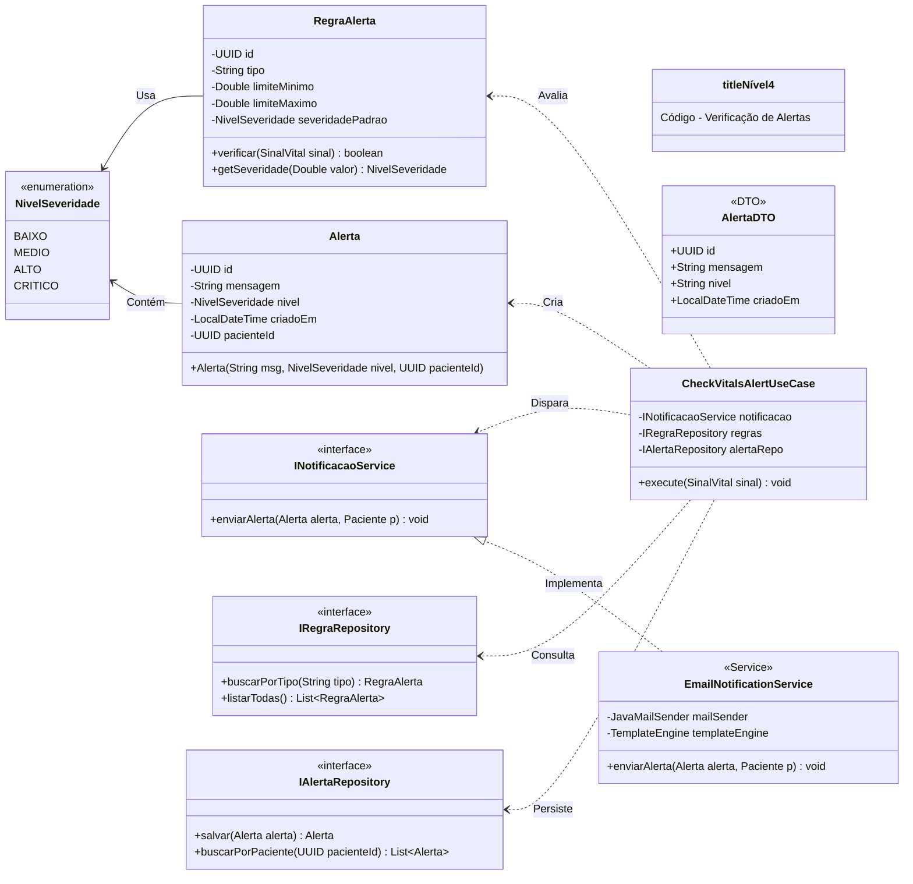
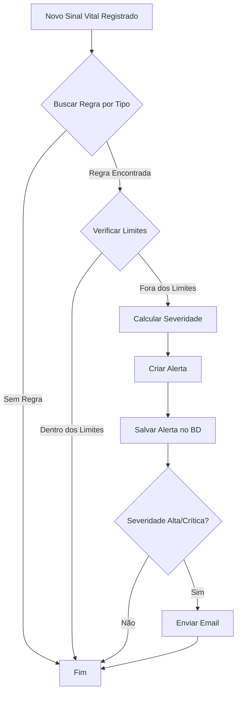

# C4 - Nível 4: Código - Verificação de Alertas

## Diagrama de Classes



## Código Java

### Domain Layer - RegraAlerta.java

```java
package com.healthmonitor.domain.entities;

import java.util.UUID;

public class RegraAlerta {
    private UUID id;
    private String tipo;
    private Double limiteMinimo;
    private Double limiteMaximo;
    private NivelSeveridade severidadePadrao;

    public RegraAlerta(String tipo, Double limiteMinimo, Double limiteMaximo, NivelSeveridade severidade) {
        this.id = UUID.randomUUID();
        this.tipo = tipo;
        this.limiteMinimo = limiteMinimo;
        this.limiteMaximo = limiteMaximo;
        this.severidadePadrao = severidade;
    }

    public boolean verificar(SinalVital sinal) {
        if (!this.tipo.equals(sinal.getTipo())) {
            return false;
        }
        Double valor = sinal.getValor();
        return valor < limiteMinimo || valor > limiteMaximo;
    }

    public NivelSeveridade getSeveridade(Double valor) {
        double desvio = Math.max(
            limiteMinimo - valor,
            valor - limiteMaximo
        );

        if (desvio > 20) return NivelSeveridade.CRITICO;
        if (desvio > 10) return NivelSeveridade.ALTO;
        if (desvio > 5) return NivelSeveridade.MEDIO;
        return NivelSeveridade.BAIXO;
    }

    // Getters
    public UUID getId() { return id; }
    public String getTipo() { return tipo; }
    public Double getLimiteMinimo() { return limiteMinimo; }
    public Double getLimiteMaximo() { return limiteMaximo; }
}
```

### Domain Layer - Alerta.java

```java
package com.healthmonitor.domain.entities;

import java.time.LocalDateTime;
import java.util.UUID;

public class Alerta {
    private UUID id;
    private String mensagem;
    private NivelSeveridade nivel;
    private LocalDateTime criadoEm;
    private UUID pacienteId;

    public Alerta(String mensagem, NivelSeveridade nivel, UUID pacienteId) {
        this.id = UUID.randomUUID();
        this.mensagem = mensagem;
        this.nivel = nivel;
        this.pacienteId = pacienteId;
        this.criadoEm = LocalDateTime.now();
    }

    // Getters
    public UUID getId() { return id; }
    public String getMensagem() { return mensagem; }
    public NivelSeveridade getNivel() { return nivel; }
    public LocalDateTime getCriadoEm() { return criadoEm; }
    public UUID getPacienteId() { return pacienteId; }
}

public enum NivelSeveridade {
    BAIXO, MEDIO, ALTO, CRITICO
}
```

### Application Layer - CheckVitalsAlertUseCase.java

```java
package com.healthmonitor.application.usecases;

import com.healthmonitor.application.gateways.INotificacaoService;
import com.healthmonitor.application.gateways.IRegraRepository;
import com.healthmonitor.application.gateways.IAlertaRepository;
import com.healthmonitor.domain.entities.*;

public class CheckVitalsAlertUseCase {

    private final INotificacaoService notificacao;
    private final IRegraRepository regras;
    private final IAlertaRepository alertaRepo;

    public CheckVitalsAlertUseCase(
            INotificacaoService notificacao,
            IRegraRepository regras,
            IAlertaRepository alertaRepo) {
        this.notificacao = notificacao;
        this.regras = regras;
        this.alertaRepo = alertaRepo;
    }

    public void execute(SinalVital sinal, Paciente paciente) {
        RegraAlerta regra = regras.buscarPorTipo(sinal.getTipo());

        if (regra != null && regra.verificar(sinal)) {
            NivelSeveridade severidade = regra.getSeveridade(sinal.getValor());

            String mensagem = String.format(
                "Alerta: %s fora do limite normal. Valor: %.2f %s",
                sinal.getTipo(),
                sinal.getValor(),
                sinal.getUnidade()
            );

            Alerta alerta = new Alerta(mensagem, severidade, paciente.getId());
            alertaRepo.salvar(alerta);

            if (severidade == NivelSeveridade.ALTO || severidade == NivelSeveridade.CRITICO) {
                notificacao.enviarAlerta(alerta, paciente);
            }
        }
    }
}
```

### Infrastructure Layer - EmailNotificationService.java

```java
package com.healthmonitor.infrastructure.services;

import com.healthmonitor.application.gateways.INotificacaoService;
import com.healthmonitor.domain.entities.Alerta;
import com.healthmonitor.domain.entities.Paciente;
import org.springframework.mail.javamail.JavaMailSender;
import org.springframework.mail.javamail.MimeMessageHelper;
import org.springframework.stereotype.Service;
import org.thymeleaf.TemplateEngine;
import org.thymeleaf.context.Context;

import jakarta.mail.MessagingException;
import jakarta.mail.internet.MimeMessage;

@Service
public class EmailNotificationService implements INotificacaoService {

    private final JavaMailSender mailSender;
    private final TemplateEngine templateEngine;

    public EmailNotificationService(JavaMailSender mailSender, TemplateEngine templateEngine) {
        this.mailSender = mailSender;
        this.templateEngine = templateEngine;
    }

    @Override
    public void enviarAlerta(Alerta alerta, Paciente paciente) {
        try {
            MimeMessage message = mailSender.createMimeMessage();
            MimeMessageHelper helper = new MimeMessageHelper(message, true);

            helper.setTo(paciente.getEmail());
            helper.setSubject("⚠️ Alerta de Saúde - HealthMonitor");

            Context context = new Context();
            context.setVariable("paciente", paciente.getNome());
            context.setVariable("mensagem", alerta.getMensagem());
            context.setVariable("nivel", alerta.getNivel().name());

            String html = templateEngine.process("alerta-email", context);
            helper.setText(html, true);

            mailSender.send(message);
        } catch (MessagingException e) {
            throw new RuntimeException("Falha ao enviar email de alerta", e);
        }
    }
}
```

## Fluxo de Verificação


